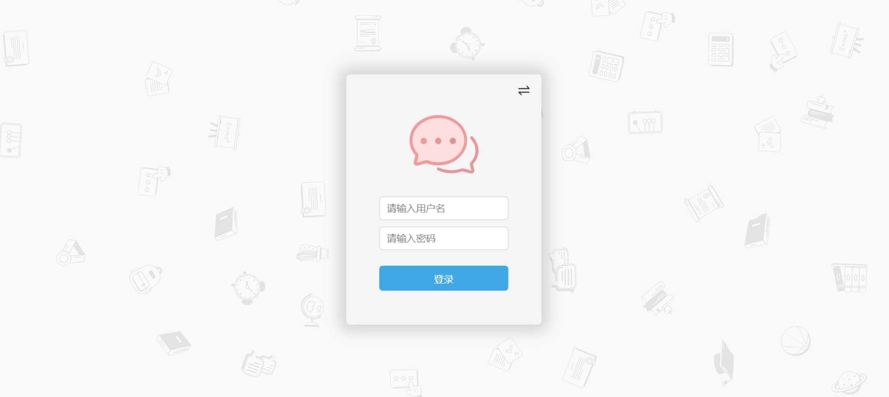
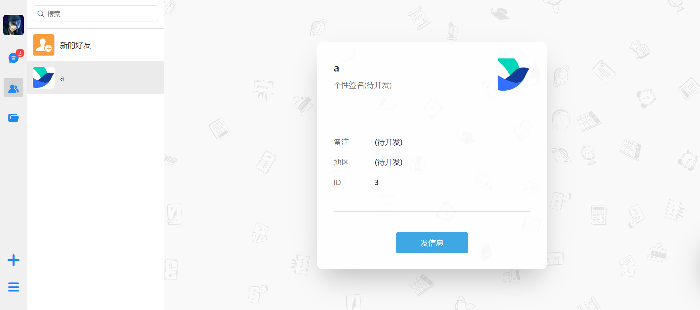
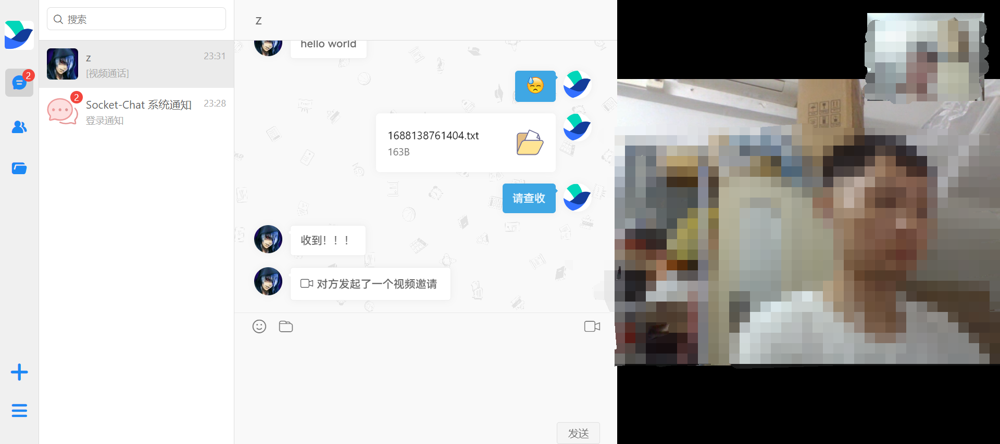

<div align="center">
  
<h1>Socket-Chat</h1>

<p>基于 Vue3 的 Web 端的在线聊天工具</p>
</div>

## Socket-Chat

Socket-Chat 是一个 Web 端的在线聊天工具，基于 vue3 + socket.io + webrtc 实现，具有以下功能：
- 基本的用户登陆注册
- 好友列表管理
- 会话列表管理
- 文件列表管理
- 好友增删
- 好友聊天(支持emoji、自定义表情、图片、文件的发送与接收)
- 图片预览大图
- 视频通话

后期会继续完善现有功能，待开发项：
- 群聊
- 语音输入
- 语音通话

## 项目预览图








## 技术栈

核心技术：vue3 + ts + vue-cli + socket.io + webrtc

辅助开发：Ant Design(UI设计)、pubsub-js(组件间通信)、vuex(组件状态管理)、vue-router(路由)、axios(http请求)

代码规范：eslint、prettier

CI/CD：gulp、github actions

## 项目亮点
- 使用 socket.io 建立双向通信
- 使用 webrtc 实现视频通话
- 无感登陆的实现
- 在聊天记录、好友列表、文件列表方面实现了分页加载
- 自定义表情实现了懒加载
- 可展示 emoji 表情的输入框
- 图片预览大图

## 主要目录结构
```
Socket-Chat
├─ chat-server   Socket-Chat 服务端
├─ chat-web      Socket-Chat 客户端
├─ md-assets     markdown 图片
├─ .gitignore    
├─ package.json  
└─ README.md     
``` 

## 更多简介

由于内容较多，具体的项目结构与实现逻辑详见以下链接：

(1) [Socket-Chat 客户端](chat-web/README.md)

(2) [Socket-Chat 服务端](chat-server/README.md)


